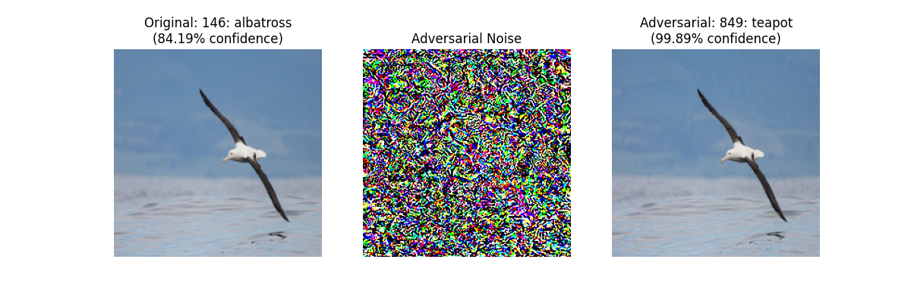

# Adversarial Noise Generator

This is a tool designed to manipulate images such that they look roughly the same to a human, but are misclassified by a pretrained model (resnet50, in this case). You input an image and a specified target class, and it outputs a slightly altered copy of the image.

## Usage Instructions

### Prepare Images

You can either download and use your own images or use the default images provided in the `sample_images` folder. Any jpg or png will work.

### Generate Adversarial Image

```bash
python generate.py <image_path> <target_class_number>
```

- **image_path**: the path of the image you wish to alter.
- **target_class_number**: the numerical identifier for the target class. The class numbers are mapped in the imagenet_classes.txt.

Example:

```bash
python generate.py sample_images/albatross.jpg 849
```

This command will modify the albatross image so that it's classified as a teapot (class number 849) by the model.



### Output

This tool will save the adversarial example image (adversarial_output_image.png) as the final output. Additionally, it will plot 3 images side by side for comparison: the original image, the adversarial noise, and the final adversarial image. 